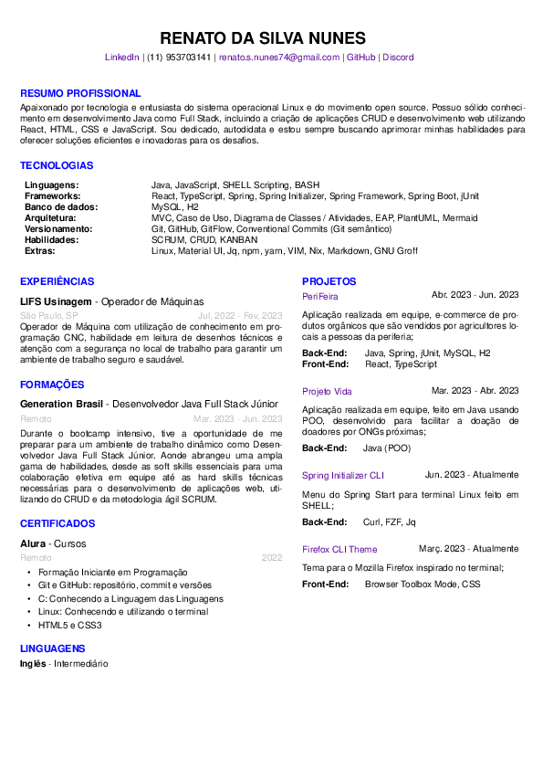

# Curriculum Vitae (CV)

<a href="https://github.com/renatonunes74/curriculum_vitae/commits/master">

<h4>Curriculum Vitae feito em Groff, com base no modelo do <a href="https://github.com/wlcsm/resume">wlcsm</a> e em boas práticas</h4>
<a href="#sobre">Sobre</a>&nbsp;&nbsp;&nbsp;|&nbsp;&nbsp;&nbsp;
<a href="#como-usar">Como usar</a>&nbsp;&nbsp;&nbsp;|&nbsp;&nbsp;&nbsp;
<a href="#funcionalidades">Funcionalidades</a>&nbsp;&nbsp;&nbsp;|&nbsp;&nbsp;&nbsp;
<a href="#organização-do-projeto">Organização do Projeto</a>

# Sobre
- Simples
- Legível
- Palavras-chaves

 

# Dependências
- Groff

# Como usar
- Clone o repositório
    - `git clone https://github.com/renatonunes74`
- Entre na pasta
    - `cd curriculum-vitae`
- Compile o arquivo usando o Groff
    - `groff -ktesp curriculo.ms -Tpdf > curriculo.pdf`

# Funcionalidades
O arquivo utiliza de macros disponíveis no Troff
- Como:
  - `.ds NOME Seu nome`
  - `.ds EMAIL Seu@email.com`
  - etc...

# Organização do Projeto
- `curriculo.ms`
    - template do currículo
- `curriculo.pdf`
    - saída PDF do currículo
- `macro.tmac`
    - local de macros
- `assets/curriculo.png`
    - opcional (gerado via `imagemagick`)
